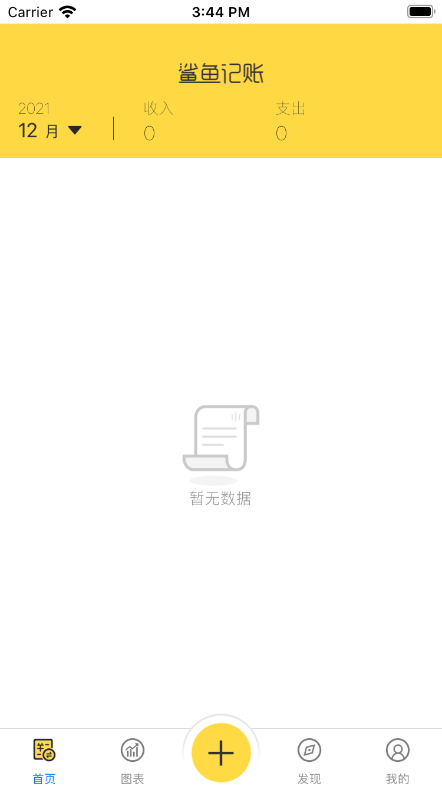

### 仿鲨鱼记账

- 2021-12-27提交至github

```
"dependencies": {
    "@react-native-async-storage/async-storage": "^1.15.14",
    "@react-native-picker/picker": "^2.2.1",
    "@react-navigation/bottom-tabs": "^6.0.9",
    "@react-navigation/native": "^6.0.6",
    "@react-navigation/native-stack": "^6.2.5",
    "deprecated-react-native-listview": "^0.0.7",
    "immutability": "^1.0.2",
    "prop-types": "^15.8.0",
    "react": "17.0.2",
    "react-native": "0.66.4",
    "react-native-actionsheet": "^2.4.2",
    "react-native-display": "^1.0.8",
    "react-native-easy-toast": "^2.0.0",
    "react-native-gesture-handler": "^2.1.0",
    "react-native-safe-area-context": "^3.3.2",
    "react-native-safe-area-view": "^1.1.1",
    "react-native-screens": "^3.10.1",
    "react-native-segmented-control-tab": "^4.0.0",
    "react-native-svg": "^12.1.1",
    "react-native-swipe-list-view": "^3.2.9",
    "react-navigation": "3.0.9",
    "react-navigation-stack": "^2.10.4",
    "react-redux": "^7.2.6",
    "redux": "^4.1.2",
    "redux-immutable": "^4.0.0",
    "redux-logger": "^3.0.6",
    "redux-saga": "^1.1.3",
    "redux-thunk": "^2.4.1"
  },
```

### 预览



